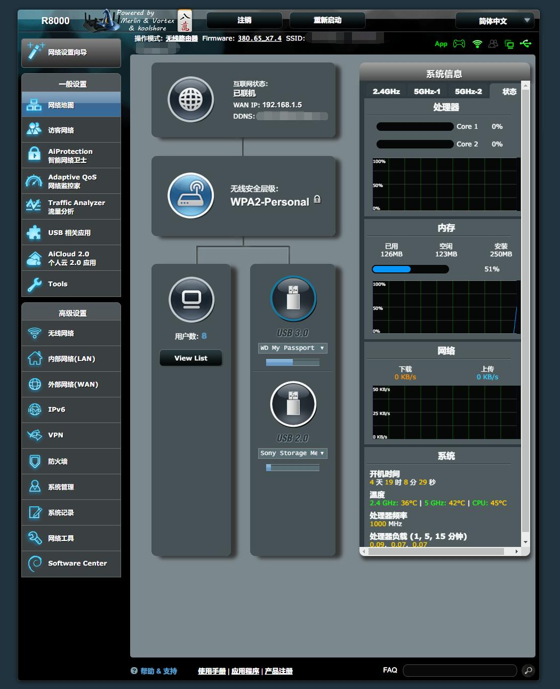
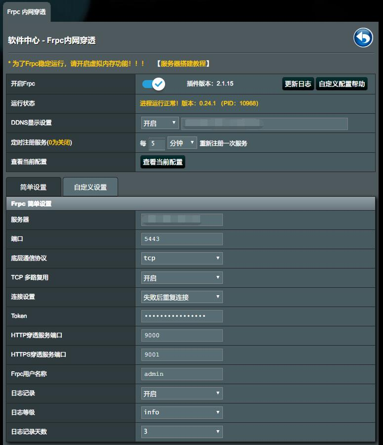
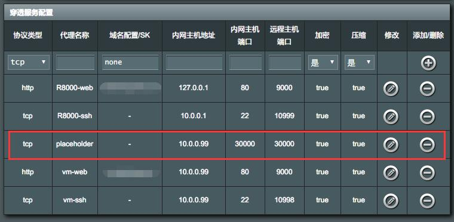

# R8000 ([网件 夜鹰X6 AC3200](https://www.netgear.com.cn/home/products/networking/wifi-routers/R8000.aspx))

### 背景

2018年11月, 父母家中网络到期, 升级至联通200M宽带.

### 购买渠道

万能的淘宝 (二手)

### 选购缘由

之前一直用的都是`MTK`的路由器, 在恩山论坛也混迹了有1年多的时间,  
经常看到网友说梅林固件怎么怎么好, 心里长草, 正好加上父母需要千兆路由器, 之前免费撸的斐迅K2不够用了,  
所以就借着这个理由就换了个`R8000`.

### 以下为折腾经历

- 因为`R8000`上市时间不短了, 所以购买全新的有点不合适, 故选择了二手 (说白了还是没钱...)  
  当时购买的是拆机产品, 卖家搭配了一套亚克力的外壳.  
   个人觉得比原装的外壳好看(天线除外), 而且可以加风扇, 这样基本上解决了发热量大的问题.  

   原装

   淘宝

- 运行截图  
  环境室温 : 稳定在20°左右 路由整体温度在可接受的范围内,

  | CPU | 2.4G | 5G |
  | :------: | :------: | :------: |
  | 45-50℃ | 35-40℃ | 45-50℃ |

  风扇供电(5V)走的是板子上的3.3V供电, 所以相当于变相降速, 噪音基本上听不见.  
  
- 添加不可描述插件  
  17年的一段时间, 国家对于梯子类软件查的比较严, 所以导致很多固件都去掉了梯子类的集成.  
  机器到手后, 默认集成软件中心, 但是版本基本上不能用, 所以先更新软件中心.  
  因为梅林固件支持离线安装, 所以搜到一个离线安装包, 之后直接在软件中心离线安装即可.
  剩下的就是配置节点, 不做不表述.

- 内网穿透 `frp`  
  项目源码地址 [Github](https://github.com/fatedier/frp)  
  
  1. 首先找一个不经常使用的U盘来当虚拟内存, 然后把U盘格式化为`ext4`格式, 插到路由上.
  2. 软件中心安装虚拟内存插件, 创建虚拟内存.
  3. 服务端安装 (一键安装脚本来自 [KoolShare论坛](http://koolshare.cn/thread-65379-1-1.html))  
  安装好后, 会生成终端输出一个默认的`frps`的配置(非配置文件), 复制到文本保存起来待用.  

    ```shell
     wget --no-check-certificate https://raw.githubusercontent.com/clangcn/onekey-install-shell/master/frps/install-frps.sh -O ./install-frps.sh  
     chmod 700 ./install-frps.sh
     ./install-frps.sh install
    ```

  4. 客户端安装  
  在软件中心里安装 `frpc穿透`  
  直接上图  
    
  这里只说下比较容易出现问题的地方, 剩余的按照服务器上输出的配置填写即可.  
      - http/https穿透服务端口 :  
      一般服务器上都会有`nginx`或者`apache`用作`web`服务器, 所以在安装`frps`的时候,  
      http和https端口不能使用80和443, 填写两个没被占用的端口, 例如我这里是9000和9001.  
      附`nginx`代理配置

        ```conf
            # 获取IP
            map $http_x_forwarded_for $clientRealip {
                "" $remote_addr;
                ~^(?P<firstAddr>[0-9\.]+),?.*$  $firstAddr;
            }
            # 管理界面
            server {
                listen 80;
                listen 443 ssl http2;
                其他配置
                server_name 你的frp管理界面域名(一般为二级域名 eg: frp.xxx.com);
                location / {
                    proxy_pass http://127.0.0.1:5443; # frps安装时配置的管理页面的端口号;
                    proxy_set_header Host $host;
                    proxy_set_header X-Real-IP $clientRealip;
                    proxy_set_header X-Forwarded-For $proxy_add_x_forwarded_for;
                }
            }
            # 穿透到内网
            server {
                listen 80;
                listen 443 ssl http2;
                其他配置
                server_name 你在外网访问内网服务的域名(一般是上面填写的二级域名下的泛三级域名 eg: *.frp.xxx.com);
                location / {
                    proxy_pass http://127.0.0.1:9000/; # 服务器设定的http端口
                    proxy_set_header Host $host;
                    proxy_set_header X-Real-IP $clientRealip;
                    proxy_set_header X-Forwarded-For $proxy_add_x_forwarded_for;
                }
            }
        ```

      - frpc用户名称 :  
    默认填写`admin`, 我刚开始配置时, 这项没有填了, 导致无法连接服务, 所以这里一定要填写!  
  5. 穿透配置  
  直接上图  
    
  配置说明  

      | 协议类型 | 代理名称 | 域名配置 | 内网主机 | 内网端口 | 远程端口 | 加密 | 压缩 | 修改 | 添加/删除 |
      | :------:| :------: | :------: | :------: | :------: | :------: | :------: | :------: | :------: | :------: |
      | 按照你内网提供服务的类型填写 | 自己看的名称, 能区分出是什么就行. | 上边`nginx`中的泛三级域名. | 字面意思 | 字面意思 | 除http/https外 需要手动填写 | 默认 | 默认 | |
      | http | vm-web | vm.frp.xxx.com | 10.0.0.99 | 80 | 9000 | true | true | |
      | tcp | vm-ssh | (协议是`tcp`时不用填) | 10.0.0.99 | 22 | 10999(需要在`frps`的服务器上开启此端口) | true | true | |

      这里不知道是固件问题还是插件问题, 配置的第三条在这里能看见(红色框), 但是在代理记录上保存不了,  
      所以当你需要穿透的服务超过3个的时候, 添加一个占位符...

  6. 更新`frp`版本  
      - 服务端更新  下载新版本直接替换即可  
      - 客户端更新  下载32位版本替换即可  

      替换完成之后记得重启服务